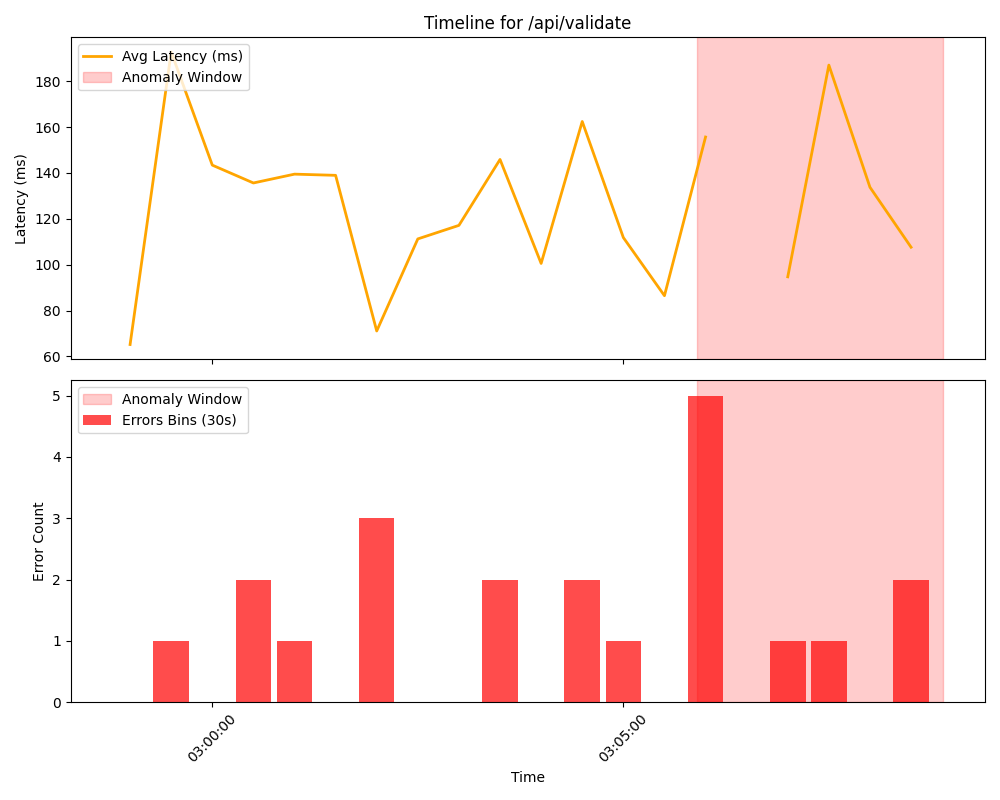

# Root Cause Analysis Report
**Incident ID**: INC-151AE1488DA0
**Generated At**: 2026-04-17T08:29:33.030458

## 1. Executive Summary
This document outlines the root cause analysis for incident `INC-151AE1488DA0`.
The detection engine observed an anomaly characterized by **Elevated error activity detected on multiple endpoints**.
Through correlation of application logs and metrics, the most probable root cause has been isolated to the **`/api/validate`** endpoint, demonstrating a **Error Rate Surge**.

- **Root Cause Endpoint**: `/api/validate`
- **Primary Signal**: Error Rate Surge
- **Confidence Score**: 0.42

## 2. Signal Analysis
During the incident window (2026-04-08 03:05:53.960615+00:00 to 2026-04-08 03:08:53.627282+00:00), signal aggregates were compared to the preceding stable baseline.

| Metric | Baseline (Normal) | Incident Window | Status |
|--------|-------------------|-----------------|--------|
| **Average Latency** | 117.69 ms | 130.75 ms | Normal |
| **Error Rate** | 42.86% | 60.00% | Spike |

### Error Category Breakdown
During the anomaly window, the distribution of exact errors for `/api/validate` was:
- **VALIDATION_ERROR**: 9 occurrences

## 3. Incident Timeline
- **2026-04-10 02:23:06+00:00**: Normal telemetry baseline confirmed.
- **2026-04-08 03:05:53.960615+00:00**: Anomaly window onset. Initial deviation detected on `/api/validate`.
- **2026-04-10 02:36:06+00:00**: Incident logged by AIOps detection engine (`INC-151AE1488DA0`).
- **2026-04-08 03:08:53.627282+00:00**: Telemetry data indicates end of peak anomaly or dataset cutoff.

## 4. Visual Evidence
*(Graph generated dynamically. Please see `incident_timeline.png` for plotted latency and error metrics over this window.)*

## 5. Recommended Actions
1. Investigate recent deployments or upstream dependencies for '/api/validate'. Primary anomaly is Error Rate Surge.
2. Implement strict rate limiting or circuit breaking on `/api/validate`.
3. Review logging and metric collection around this endpoint for deeper context.
